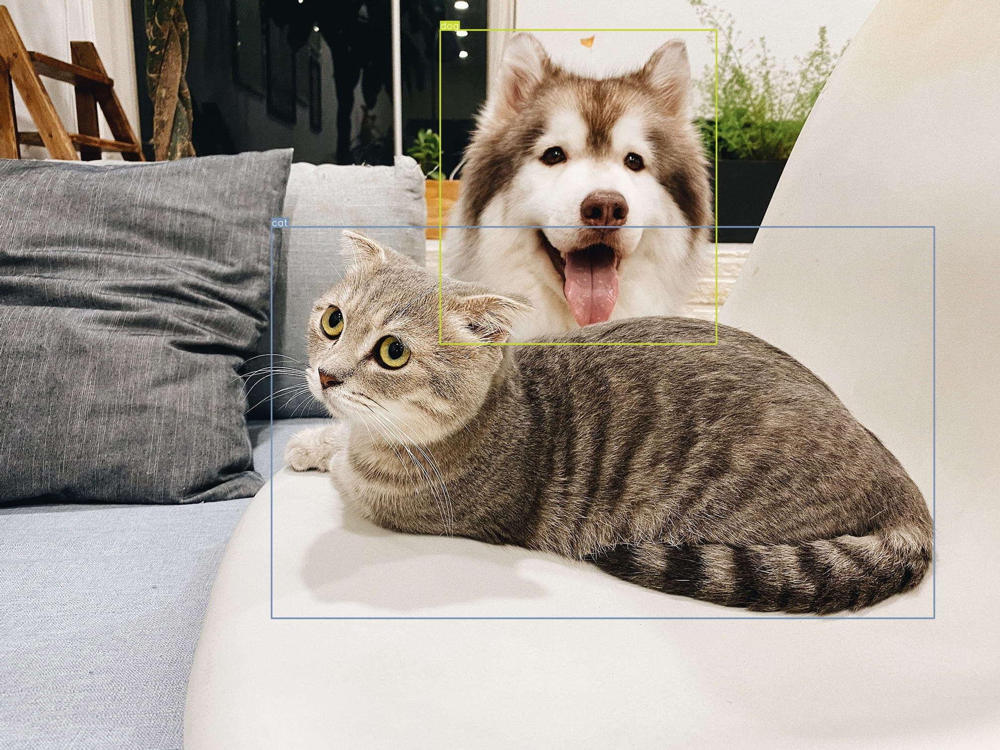
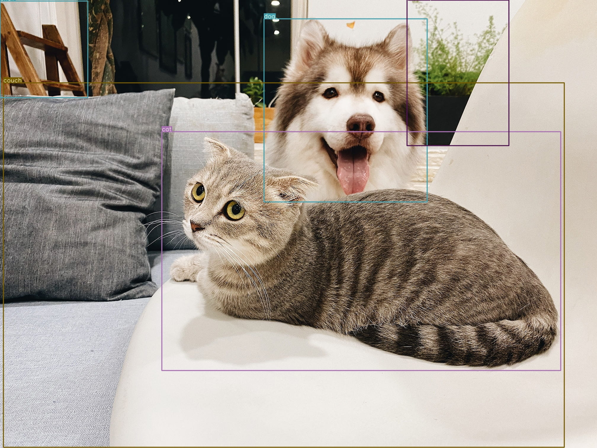
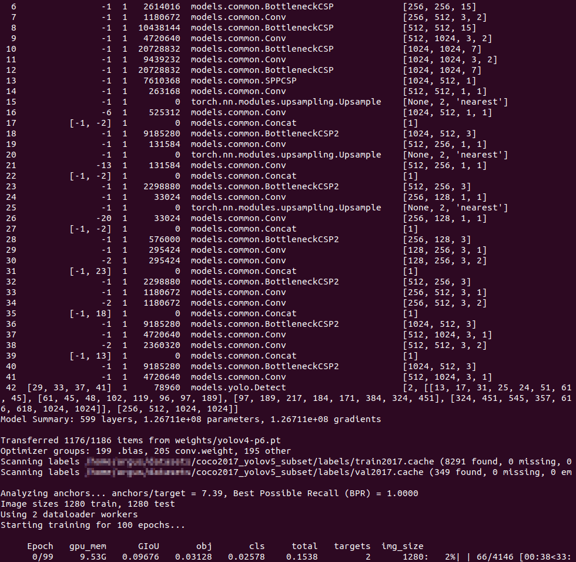

# Start Scaled YOLOv4

## Scaled-YOLOv4

- 代码: https://github.com/WongKinYiu/ScaledYOLOv4
- 论文: https://arxiv.org/abs/2011.08036
- 文章: https://alexeyab84.medium.com/scaled-yolo-v4-is-the-best-neural-network-for-object-detection-on-ms-coco-dataset-39dfa22fa982

## 环境准备

### 基础环境

- Nvidia 显卡的主机
- Ubuntu 18.04
  - 系统安装，可见 [制作 USB 启动盘，及系统安装](https://mp.weixin.qq.com/s/HHXh0GKaxfaUdemcL2IdRQ)
- Nvidia Driver
  - 驱动安装，可见 [Ubuntu 初始配置 - Nvidia 驱动](https://mp.weixin.qq.com/s/czgD2CQOnOZ_eslrRkq6LA)

### 开发环境

[Anaconda]: https://www.anaconda.com/products/individual#Downloads

下载并安装 [Anaconda][] ,之后于 Terminal 执行：

```bash
# 创建 Python 虚拟环境
conda create -n scaled-yolov4 python=3.8 -y
conda activate scaled-yolov4

# 安装 PyTorch with CUDA
conda install pytorch==1.7.1 torchvision==0.8.2 cudatoolkit=10.2 -c pytorch -y
```

注意：

- `pytorch` 等版本请对照表 [torch, torchvision, python](https://github.com/pytorch/vision#installation)
- `cudatoolkit` 版本请对照表 [CUDA Toolkit and Compatible Driver Versions](https://docs.nvidia.com/deploy/cuda-compatibility/index.html#binary-compatibility__table-toolkit-driver)
- `conda` 下载过慢，可尝试配置国内镜像源

[CUDA Toolkit]: https://developer.nvidia.com/cuda-toolkit-archive

下载 [CUDA Toolkit][] ，其版本也注意对应 Nvidia 驱动版本。下一步需要。命令参考：

```bash
wget https://developer.download.nvidia.com/compute/cuda/10.2/Prod/local_installers/cuda_10.2.89_440.33.01_linux.run
sudo sh cuda_10.2.89_440.33.01_linux.run
```

注意：安装时，请手动取消驱动安装选项。

[mish-cuda]: https://github.com/JunnYu/mish-cuda

下载 [mish-cuda][] 并安装：

```bash
# install mish-cuda, if you use different pytorch version, you could try https://github.com/thomasbrandon/mish-cuda
git clone https://github.com/JunnYu/mish-cuda
cd mish-cuda
python setup.py build install
```

下载 [ScaledYOLOv4-large](https://github.com/WongKinYiu/ScaledYOLOv4/tree/yolov4-large):

```bash
git clone -b yolov4-large https://github.com/WongKinYiu/ScaledYOLOv4
```

### 脚本依赖

```bash
conda activate scaled-yolov4

cd start-scaled-yolov4/
pip install -r scripts/requirements.txt
```

## 模型准备

[yolov4-p5.pt]: https://drive.google.com/file/d/1aXZZE999sHMP1gev60XhNChtHPRMH3Fz/view?usp=sharing
[yolov4-p6.pt]: https://drive.google.com/file/d/1aB7May8oPYzBqbgwYSZHuATPXyxh9xnf/view?usp=sharing
[yolov4-p7.pt]: https://drive.google.com/file/d/18fGlzgEJTkUEiBG4hW00pyedJKNnYLP3/view?usp=sharing

下载官方的 [yolov4-p5.pt][], [yolov4-p6.pt][], [yolov4-p7.pt][] 权重文件到 `ScaledYOLOv4/weights/` 目录。

## 现有模型测试

### 准备 COCO 数据集，转成 YOLO 格式

下载 [COCO](http://cocodataset.org/) 数据集，

```bash
coco2017
├── annotations
│   ├── instances_train2017.json
│   └── instances_val2017.json
├── test2017
├── train2017
└── val2017
```

转成 [YOLOv5 数据集结构](https://github.com/ultralytics/yolov5/wiki/Train-Custom-Data#3-organize-directories)，

```bash
export COCO_DIR=~/datasets/coco2017
export OUTPUT_DIR=~/datasets/coco2017_yolov5

# train2017 训练集
# - 图片：目录软链到 images/
# - 标注：转换存储进 labels/*.txt
# - 物体类型：全部记录进 *.names
# - 图片列表：有物体标注的记录进 *.txt, 无的进 *.txt.ignored
python scripts/coco2yolov5.py \
--coco_img_dir $COCO_DIR/train2017/ \
--coco_ann_file $COCO_DIR/annotations/instances_train2017.json \
--output_dir $OUTPUT_DIR

# val2017 验证集
# - 物体类型：依照训练集的记录，保证顺序
python scripts/coco2yolov5.py \
--coco_img_dir $COCO_DIR/val2017/ \
--coco_ann_file $COCO_DIR/annotations/instances_val2017.json \
--output_dir $OUTPUT_DIR \
--obj_names_file $OUTPUT_DIR/train2017.names
```

如下：

```bash
coco2017_yolov5/
├── images
│   ├── train2017 -> /home/john/datasets/coco2017/train2017
│   └── val2017 -> /home/john/datasets/coco2017/val2017
├── labels
│   ├── train2017
│   └── val2017
├── train2017.names
├── train2017.txt
├── train2017.txt.ignored
├── val2017.txt
└── val2017.txt.ignored
```

`coco2017_yolov5` 软链到 `ScaledYOLOv4/` 目录，并添加 `ScaledYOLOv4/data/coco2017_yolov5.yaml` 文件，描述数据集：

```yaml
# train and val datasets (image directory or *.txt file with image paths)
train: ./coco2017_yolov5/images/train2017
val: ./coco2017_yolov5/images/val2017
test: ./coco2017_yolov5/images/val2017

# number of classes
nc: 80

# class names
names: ['person', 'bicycle', 'car', 'motorcycle', 'airplane', 'bus', 'train', 'truck', 'boat', 'traffic light',
        'fire hydrant', 'stop sign', 'parking meter', 'bench', 'bird', 'cat', 'dog', 'horse', 'sheep', 'cow',
        'elephant', 'bear', 'zebra', 'giraffe', 'backpack', 'umbrella', 'handbag', 'tie', 'suitcase', 'frisbee',
        'skis', 'snowboard', 'sports ball', 'kite', 'baseball bat', 'baseball glove', 'skateboard', 'surfboard',
        'tennis racket', 'bottle', 'wine glass', 'cup', 'fork', 'knife', 'spoon', 'bowl', 'banana', 'apple',
        'sandwich', 'orange', 'broccoli', 'carrot', 'hot dog', 'pizza', 'donut', 'cake', 'chair', 'couch',
        'potted plant', 'bed', 'dining table', 'toilet', 'tv', 'laptop', 'mouse', 'remote', 'keyboard', 'cell phone',
        'microwave', 'oven', 'toaster', 'sink', 'refrigerator', 'book', 'clock', 'vase', 'scissors', 'teddy bear',
        'hair drier', 'toothbrush']
```

### 测试 YOLOv4-P5

```bash
cd ScaledYOLOv4

conda activate scaled-yolov4
pip install opencv-python pyyaml scipy tqdm

python test.py \
--img 896 \
--conf 0.001 \
--batch 8 \
--device 0 \
--data data/coco2017_yolov5.yaml \
--weights weights/yolov4-p5.pt
```

结果如下：

```bash
Fusing layers... Model Summary: 331 layers, 7.07943e+07 parameters, 6.81919e+07 gradients
Scanning labels coco2017_yolov5/labels/val2017.cache (4952 found, 0 missing, 48 empty, 0 duplicate, for 5000 images): 100%|█| 5000/5000 [00:00<00:
               Class      Images     Targets           P           R      mAP@.5  mAP@.5:.95: 100%|█████████████| 625/625 [01:34<00:00,  6.64it/s]
                 all       5e+03    3.68e+04       0.456        0.76       0.687       0.494
Speed: 14.3/1.5/15.8 ms inference/NMS/total per 896x896 image at batch-size 8
```

进行推断，

```bash
python detect.py \
--img 896 \
--conf 0.5 \
--device 0 \
--weights weights/yolov4-p5.pt \
--source demo.jpg
```

结果如下，

```bash
Fusing layers... Model Summary: 331 layers, 7.07943e+07 parameters, 6.81919e+07 gradients
image 1/1 /home/john/Codes/ScaledYOLOv4/demo.jpg: 768x896 1 cats, 1 dogs, Done. (0.029s)
Results saved to inference/output
Done. (0.133s)
```



### 测试 YOLOv4-P7

```bash
python test.py \
--img 1536 \
--conf 0.001 \
--batch 6 \
--device 0 \
--data data/coco2017_yolov5.yaml \
--weights weights/yolov4-p7.pt
```

结果如下：

```bash
Fusing layers... Model Summary: 503 layers, 2.87475e+08 parameters, 2.7862e+08 gradients
Scanning labels coco2017_yolov5/labels/val2017.cache (4952 found, 0 missing, 48 empty, 0 duplicate, for 5000 images): 100%|█| 5000/5000 [00:00<00:
               Class      Images     Targets           P           R      mAP@.5  mAP@.5:.95: 100%|█████████████| 834/834 [06:57<00:00,  2.00it/s]
                 all       5e+03    3.68e+04       0.435       0.804       0.719       0.531
Speed: 78.2/1.6/79.8 ms inference/NMS/total per 1536x1536 image at batch-size 6
```

进行推断，

```bash
python detect.py \
--img 1536 \
--conf 0.5 \
--device 0 \
--weights weights/yolov4-p7.pt \
--source demo.jpg
```

结果如下，

```bash
Fusing layers... Model Summary: 503 layers, 2.87475e+08 parameters, 2.7862e+08 gradients
image 1/1 /home/john/Codes/ScaledYOLOv4/demo.jpg: 1152x1536 1 cats, 1 dogs, 1 chairs, 1 couchs, 1 potted plants, Done. (0.079s)
Results saved to inference/output
Done. (0.282s)
```



## 自定义数据集训练

### 准备数据集

这里从 COCO 数据集拿出一个子集，作为自定义数据集的演示：

```bash
cat <<EOF > subset.names
cat
dog
EOF

export COCO_DIR=~/datasets/coco2017
export OUTPUT_DIR=~/datasets/coco2017_yolov5_subset

python scripts/coco2yolov5.py \
--coco_img_dir $COCO_DIR/train2017/ \
--coco_ann_file $COCO_DIR/annotations/instances_train2017.json \
--output_dir $OUTPUT_DIR \
--obj_names_file subset.names

python scripts/coco2yolov5.py \
--coco_img_dir $COCO_DIR/val2017/ \
--coco_ann_file $COCO_DIR/annotations/instances_val2017.json \
--output_dir $OUTPUT_DIR \
--obj_names_file subset.names
```

`coco2017_yolov5_subset` 软链到 `ScaledYOLOv4/` 目录，并添加 `ScaledYOLOv4/data/coco2017_yolov5_subset.yaml` 文件，描述数据集：

```yaml
# train and val datasets (image directory or *.txt file with image paths)
train: ./coco2017_yolov5_subset/train2017.txt
val: ./coco2017_yolov5_subset/val2017.txt
test: ./coco2017_yolov5_subset/val2017.txt

# number of classes
nc: 2

# class names
names: ['cat', 'dog']
```

### 准备参数文件

> 这里以 `YOLOv4-P6` 为例，`P5`, `P7` 一样。

复制  `ScaledYOLOv4/models/yolov4-p6.yaml` 到 `ScaledYOLOv4/models/coco2017_yolov5_subset/yolov4-p6.yaml` 文件，修改 `nc` 参数：

```bash
nc: 2  # number of classes
```

### 训练模型

```bash
conda activate scaled-yolov4
pip install tensorboard

python train.py -h
```

参数，

```bash
optional arguments:
  -h, --help            show this help message and exit
  --weights WEIGHTS     initial weights path
  --cfg CFG             model.yaml path
  --data DATA           data.yaml path
  --hyp HYP             hyperparameters path, i.e. data/hyp.scratch.yaml
  --epochs EPOCHS
  --batch-size BATCH_SIZE
                        total batch size for all GPUs
  --img-size IMG_SIZE [IMG_SIZE ...]
                        train,test sizes
  --rect                rectangular training
  --resume [RESUME]     resume from given path/last.pt, or most recent run if blank
  --nosave              only save final checkpoint
  --notest              only test final epoch
  --noautoanchor        disable autoanchor check
  --evolve              evolve hyperparameters
  --bucket BUCKET       gsutil bucket
  --cache-images        cache images for faster training
  --name NAME           renames results.txt to results_name.txt if supplied
  --device DEVICE       cuda device, i.e. 0 or 0,1,2,3 or cpu
  --multi-scale         vary img-size +/- 50%
  --single-cls          train as single-class dataset
  --adam                use torch.optim.Adam() optimizer
  --sync-bn             use SyncBatchNorm, only available in DDP mode
  --local_rank LOCAL_RANK
                        DDP parameter, do not modify
  --logdir LOGDIR       logging directory
```

训练，

```bash
python train.py \
--batch-size 2 \
--img 1280 1280 \
--data data/coco2017_yolov5_subset.yaml \
--cfg models/coco2017_yolov5_subset/yolov4-p6.yaml \
--weights '' \
--sync-bn \
--device 0,1 \
--name yolov4-p6 \
--epochs 100
```

信息如下：



内容如下：

```bash
runs/exp0_yolov4-p6/
├── events.out.tfevents.1610070159.john-ubuntu18.17638.0
├── hyp.yaml
├── labels.png
├── opt.yaml
├── results.png
├── results.txt
├── test_batch0_gt.jpg
├── test_batch0_pred.jpg
├── train_batch0.jpg
├── train_batch1.jpg
├── train_batch2.jpg
└── weights
    ├── best_yolov4-p6.pt
    ├── best_yolov4-p6_strip.pt
    ├── last_000.pt
    ├── last_yolov4-p6.pt
    └── last_yolov4-p6_strip.pt
```

#### 错误 `RuntimeError: main thread is not in main loop`

```bash
Exception ignored in: <function Image.__del__ at 0x7f609bf9bd30>
Traceback (most recent call last):
  File "/home/john/anaconda3/envs/scaled-yolov4/lib/python3.8/tkinter/__init__.py", line 4014, in __del__
    self.tk.call('image', 'delete', self.name)
RuntimeError: main thread is not in main loop
Tcl_AsyncDelete: async handler deleted by the wrong thread
Aborted (core dumped)
```

如果发生此错误，可于 `train.py` `__main__` 修改 GUI 的 `backend`：

```bash
if __name__ == '__main__':
    import matplotlib.pyplot as plt
    plt.switch_backend("agg")
```

### 测试模型

```bash
python test.py \
--img 1280 \
--conf 0.001 \
--batch 8 \
--device 0 \
--data data/coco2017_yolov5_subset.yaml \
--weights runs/exp0_yolov4-p6/weights/best_yolov4-p6_strip.pt
```

进行推断，

```bash
python detect.py \
--img 1280 \
--conf 0.5 \
--device 0 \
--weights runs/exp0_yolov4-p6/weights/best_yolov4-p6_strip.pt
--source demo.jpg
```
